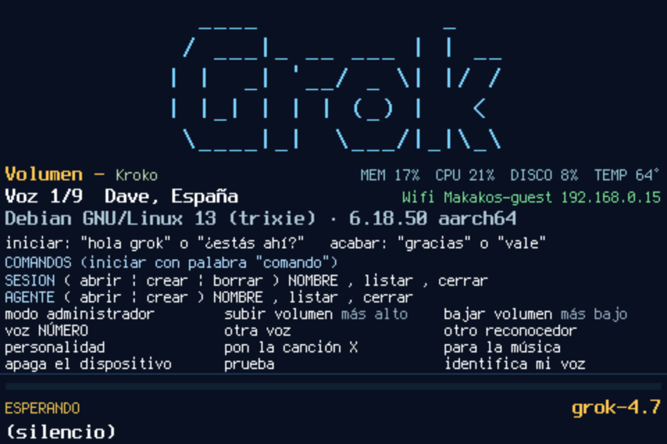

# Using Grok Pi Assistance

This is the guide for the assistant while it is running. The picture below is the panel on this Raspberry Pi, captured from the framebuffer the program is drawing. How to build the same machine is in [PI_ASSISTANCE_GROK.md](PI_ASSISTANCE_GROK.md).

Speech on this Pi is Spanish. You talk. It answers in one or two spoken sentences. The microphone and the speakers are whatever Raspberry Pi OS already selected. The picture is `fb0`, the console framebuffer.

## The screen

From top to bottom, that picture is:

- The Grok mark. A tap on it turns listening off and on, except while a song is audible.
- **Volumen**, then the recognizer name. On the right: memory, CPU, disk, and CPU temperature. The volume line shows a percent of the system mixer. A dash means that mixer did not report a playback level.
- **Voz 1/9** and the voice name. On the right, Wi-Fi and the address, when the link is up.
- The operating system line. At the end of that same line, the build that is running (`build` and seven characters). When this copy matches the published one, those characters are that commit.
- How a talk starts and ends, then **COMANDOS**. The word `comando` is written once, on that header. The lines under it do not repeat it.
- The status. **ESPERANDO** means it is listening and no talk is open. **CONVERSACIÓN** means a talk is open. **BUSCANDO** means a cloud answer is in progress. **PAUSA** means listening is off. **PRUEBA** means it is only showing what it hears. The model name sits on the right of that row.
- The bottom line. **(silencio)** is the idle line. While someone is speaking it stays on **escuchando…** and then shows the words. It does not jump back to silencio on every empty gap.

## Start and stop a talk

Say **hola grok**. It answers «Hola.» and waits. It does not search those words and it does not send them anywhere. `comando nombre Miguel` changes that call to **hola Miguel**. **hola grok** still opens a talk.

**¿estás ahí, Grok?** and **Grok, ¿estás ahí?** are answered «Sí, aquí estoy.» With another name, **¿estás ahí, Miguel?** does the same. A short **hola** on its own also opens a talk. **ok grok** and **despierta grok** do not.

**gracias** alone is answered «De nada.» and the talk ends. **vale** alone is answered «Vale.» and the talk ends. You do not say `comando` for those.

Every other order starts with the word **comando**. If the rest is an exact local order, it runs at once. If the recognizer smudges it, Grok is asked to repair it, and the assistant says «Has dicho: …. ¿Sí o no?» before doing anything. **sí** or **vale** confirms.

Inside an open talk you can ask for a song without the word `comando`. If an answer line starts with `COMANDO:`, that order is run and the line is not read aloud.

## Orders on the screen

Say `comando` and then the line.

| Say | What happens |
|---|---|
| SESION abrir, crear, borrar NOMBRE, listar, cerrar | Local sessions. Creating and deleting ask for sí or no. `cerrar sesión` inside a talk returns the screen to ESPERANDO. |
| AGENTE abrir, crear NOMBRE, listar, cerrar | Agents from the account and from this Pi. Creating one asks for the administrator key and does not open it. |
| modo administrador | Asks for the spoken key, then stays in administrator mode for five minutes. |
| lista las personas | Administrator only. Speaks the saved names. |
| borra NOMBRE | Administrator only. Asks sí or no, then deletes that person, their voice print, and their recordings. |
| subir volumen / bajar volumen | Louder or quieter. «más alto» and «más bajo» work too. |
| voz NÚMERO | That voice, counting from 1. There are nine Spanish Piper voices. |
| otra voz | The next voice. |
| otro reconocedor | The next installed engine: Kroko, Whisper pequeño, Whisper base, Whisper small, or Canary. |
| reconocedor kroko, whisper, base, small, or canary | That engine. If its folder is missing, the assistant says so and keeps the current one. |
| personalidad | The active personality, or «Sin personalidad.» |
| personalidad vega | One of alex, vega, nico, lucia, marcos, ines, bruno, carmen. The id or the name both work. |
| nombre | The name it answers to, and «hola» plus that name. |
| nombre Miguel | From now on the call is «hola Miguel». A short Spanish name is easier for the Spanish ear than the English word Grok. |
| pon la canción X | Plays the audio of a YouTube match. The microphone stays off while it is audible. |
| para la música | Stops the song. |
| apaga el dispositivo | Asks «¿Apago el dispositivo? Di sí o no.» Only a yes from the locked voice powers the Pi off. |
| prueba | Writes what the selected engine hears, and the engine’s name under it. Runs nothing, until you say `salir`. |
| identifica mi voz | Records this person. Sixteen phrases, once. |

`ayuda` shows this list again and speaks a short reminder. It does not require administrator mode.

## One voice

`comando identifica mi voz` is spoken, so you do not have to read the panel. It asks «¿Cómo te llamas?» Two words, such as Jose Antonio, are one person. A saved voice or a saved name is replaced only after a yes. A new name is stored only after a yes. `salir` cancels at any moment.

It then says it will record sixteen phrases once, that it keeps the raw sound without checking the words, and that you should speak after the beep and wait for the second beep. The first phrase is “1 de 16. hola” plus the name it answers to. That is “hola grok” until `comando nombre` sets another one, for example “hola Miguel”. The Spanish ear has more trouble with the English word Grok than with a Spanish name. The rest follow as “2 de 16. estás ahí”, and so on. A high beep starts the take. A low beep ends it. Speak after the first and wait for the second. The bottom line shows `DI:` for the phrase and `OI:` for what it heard. Those words are only what was heard. They are not compared with the phrase, and the print is not built from the first word. Each phrase is one recording and one voice print. A take that produces that print moves on, so the first one goes from “1 de 16” to “2 de 16”. Sound shorter than half a second can fail to produce a print. Hearing the words and still missing the print asks for that same phrase again. Three misses in a row stop. That miss is not the missing-model line. The missing-model line is only when the CampPlus file itself is absent.

When it finishes, that name is the only voice it will hear: the wake, every `comando`, yes and no, and the open talk. Someone else saying «hola grok» gets nothing. Only that voice can identify again. Other saved names stay in the file. An administrator can list them or delete one.

Until the first recording, no voice is locked, so the first `identifica mi voz` can come from whoever is speaking. If the voice-print model is missing, the door stays open.

## What you can change by voice

**Voices.** Dave, España is voice 1. The list continues through Spain, Mexico, and Argentina. The active number is stored on the Pi and is not reset when the program starts.

**Listening engines.** Kroko writes the words while you are speaking. The others wait until you pause, then close the phrase. With no scores yet, startup uses Kroko. After a recording, the installed engine with the best score is chosen at the next start. Whisper small can be asked for by name. It is not chosen by itself. There is no percentage on the screen. The number is only in the journal.

Outside test mode, each finished phrase is read again on the Pi with Whisper base, or with Whisper pequeño when base is not installed. That second reading is there so an English name is not lost. A reread that is only one token, such as “1.0”, does not replace a real phrase. «me escuchas», «me oyes», and «estás ahí» are not read again. In test mode the line stays what the selected engine heard, and the engine’s name is shown under it.

**Agents.** `comando listar agentes` speaks the bare names it can open, from the signed-in account and from markdown files on this Pi. A local file with the same name wins. `comando abrir agente explore` opens that file. Creating one asks for the administrator key and leaves it closed. `comando cerrar agente` returns to the normal assistant and does not delete the file.

**Personalities.** Eight fixed people, in `personalities.json`. Empty means the usual assistant. The chosen person changes the tone of the spoken answer. It does not change the command list, and the assistant does not announce which person is in use. A ninth personality cannot be created by talking.

## What leaves the Pi

The microphone audio stays on the Pi. Speech is turned into text locally. Grok in the cloud receives text only after you have addressed the assistant: a question in an open talk, a `comando` it could not match locally, or a song request. Ordinary conversation in the room is ignored.

A question shows **BUSCANDO** and «Buscando en la nube», one short waiting line is spoken, and the microphone stays off until the answer has been spoken.

## Where the files are

The program is `/home/antonio/grok-assistant`. Voice prints, the chosen voice, and the chosen engine stay in `~/.config/grok-assistant/` on the machine. Recordings stay in `raw/` next to them. None of that is in the repository.

The spoken administrator key, when this machine has one, stays in the config file on the device. The copy of `config.json` in the repository has an empty key, so administrator mode stays closed until a key is set there.
