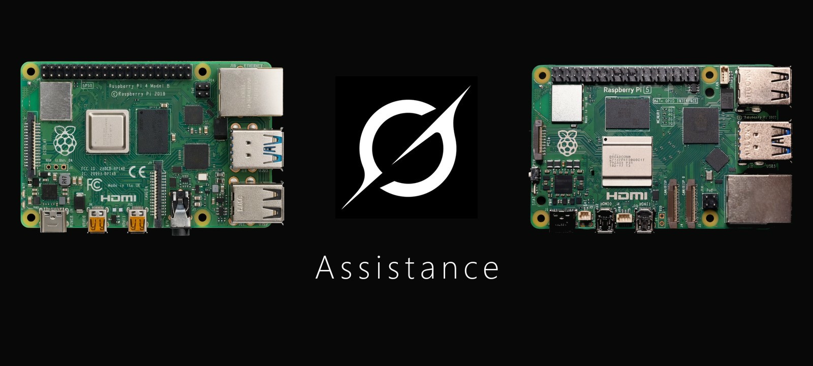

# Grok Pi Assistance

This is a voice companion for the moments when reading is difficult and the house is quiet. A Raspberry Pi 4 with 4 GB of RAM is enough to run it as its own small device, and a Raspberry Pi 5 is the same assistant on a newer board, for a family that would rather not leave a laptop open. The microphone can stay ready. The audio stays on the Pi. Only text that was meant for the assistant is sent out.

I spent years waiting for the Amazon Echo to become a better listener. It never really became more than a speaker with a light ring, so I decided to build my own.

In my case, that person is my father. His eyesight is limited, and he spends many hours on his own. I wanted him to have a voice he could simply talk to — one that could answer questions and explain things without making him find a screen or read small text. That is now possible. Grok on this machine is also the foundation for the features and integrations I plan to add next.

While the program is running, it can keep listening. Speech is turned into text on the Pi. Grok only receives text when the assistant has actually been addressed: after a greeting, for a question, for a command beginning with `comando`, or when someone asks for a song. Ordinary conversation stays on the device. If a command is unclear or misheard, Grok can help interpret it, but the assistant still asks for a `sí` before doing anything.

The voice on this Pi is Spanish, because that is the language it was built and tested in. There is no on-device Grok model. Questions go to Grok in the cloud. Exact local orders run on the Pi.

The picture is the framebuffer Raspberry Pi OS already assigned (`fb0`). Playback and the microphone are the ALSA devices the operating system already selected. This project does not configure HDMI, the screen, or a sound card.

The desktop tray app, for a computer that is already nearby, is the separate repository [antonio-castellon/grok_assistant](https://github.com/antonio-castellon/grok_assistant). How to use the running assistant, with a picture of its screen, is in [GUIDE.md](GUIDE.md). How this Pi listens, and how to reproduce it, is in [PI_ASSISTANCE_GROK.md](PI_ASSISTANCE_GROK.md).

## Clean install

On a fresh Raspberry Pi OS:

```bash
git clone https://github.com/antonio-castellon/Grok_Pi_Assistance.git
cd Grok_Pi_Assistance
./install-pi.sh
```

Run that as the normal user, not as root. The script:

- installs Python, ALSA utilities, mpv, NetworkManager, the console fonts, and espeak-ng
- puts the user in the `audio`, `video`, `input`, and `netdev` groups
- leaves HDMI, the screen, and the sound devices as Raspberry Pi OS configured them
- creates `.venv` and downloads the speech models (about 2.1 GB, including Whisper small)
- installs the Grok CLI if `~/.grok/bin/grok` is missing
- installs `wifi-boot` and `grok-assistant` for this user
- enables the Wi-Fi boot service only

`grok-assistant` stays disabled at boot. `wifi-boot` starts it after the network answers. If there is no network, `fb0` shows a touch menu to join Wi-Fi.

The picture is `fb0`. Playback and the microphone are the ALSA `default` devices. Sign in on the machine, outside this repository:

```bash
~/.grok/bin/grok
```

Cloud questions need that login. Wakes, volume, music, and voice enrollment do not. Do not commit a token.

`setup.sh` alone refreshes the virtualenv and the models. `install-pi.sh` is the full machine setup.

## What is not in this repository

Speech models, the virtualenv, and `bin/` are downloaded or built on the Pi. They are listed in `.gitignore`.

These stay on the device and must not be committed:

- any password, sudo secret, or API token
- `~/.config/grok-assistant/config.json` when it holds a spoken administrator key
- `~/.config/grok-assistant/speakers.json` (voice prints) and `~/.config/grok-assistant/raw/` (enrollment audio)
- session files under `~/.config/grok-assistant/` and `~/.grok/sessions/`

The `config.json` in this repository has an empty `admin_key`. Administrator mode stays closed until a key is set on the machine.

Nemotron is not installed. On this Pi it was too slow to be a menu choice.
